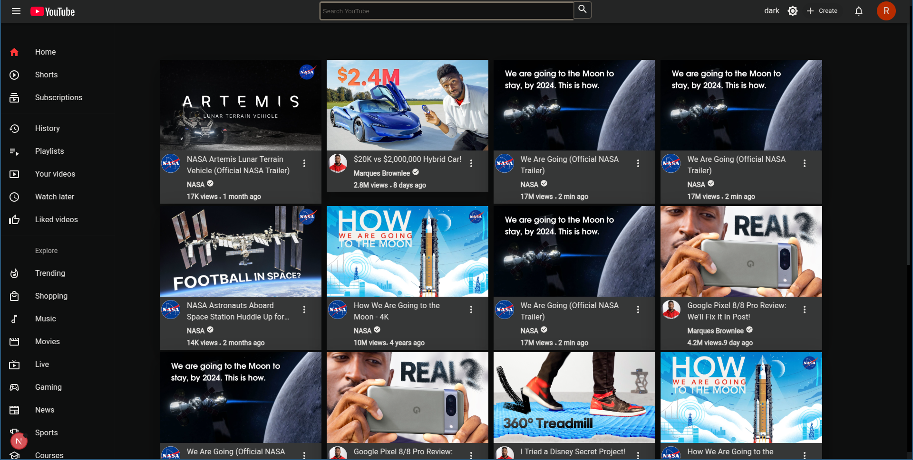

# YouTube Clone

A full-featured YouTube clone built using modern web technologies. This project allows users to upload, watch, like, comment, and share videos, replicating key features of the popular video-sharing platform.

## Features

- User authentication (signup, login, logout)

- Video upload & streaming

- Like, comment, and share functionality

- User profiles & subscriptions

- Search & recommendation system

- Dark mode support

- Responsive design

## Tech Stack

- Frontend: Nextjs,  MUI

- Backend: Node.js

- Database: MongoDB

- Storage: Firebase/AWS S3

- Video Processing: vidstack

## Installation

1. Clone the repository:

<code>git clone https://github.com/kamlendras/youtube-clone.git  
cd youtube-clone</code>

2. Install dependencies:

<code>bun install</code>

3. Set up environment variables:

Create a <code>.env</code> file in the root directory

Add required variables (e.g., database URI, API keys)

4. Start the development server:

<code>npm run dev</code>

## Usage

- Sign up for an account to upload and interact with videos.

- Browse and search for videos.

- Subscribe to channels to receive updates.

- Like, comment, and share videos.

### Contributing

Contributions are welcome! To contribute:

1. Fork the repository.

2. Create a new branch.

3. Make your changes and commit them.

4. Push to your fork and submit a pull request.

### License

This project is licensed under the MIT License.

Contact

For questions or collaboration, reach out via:

Email: kamlendrax@gmail.com

